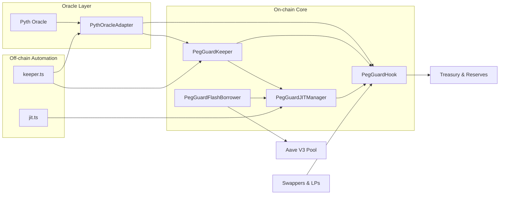
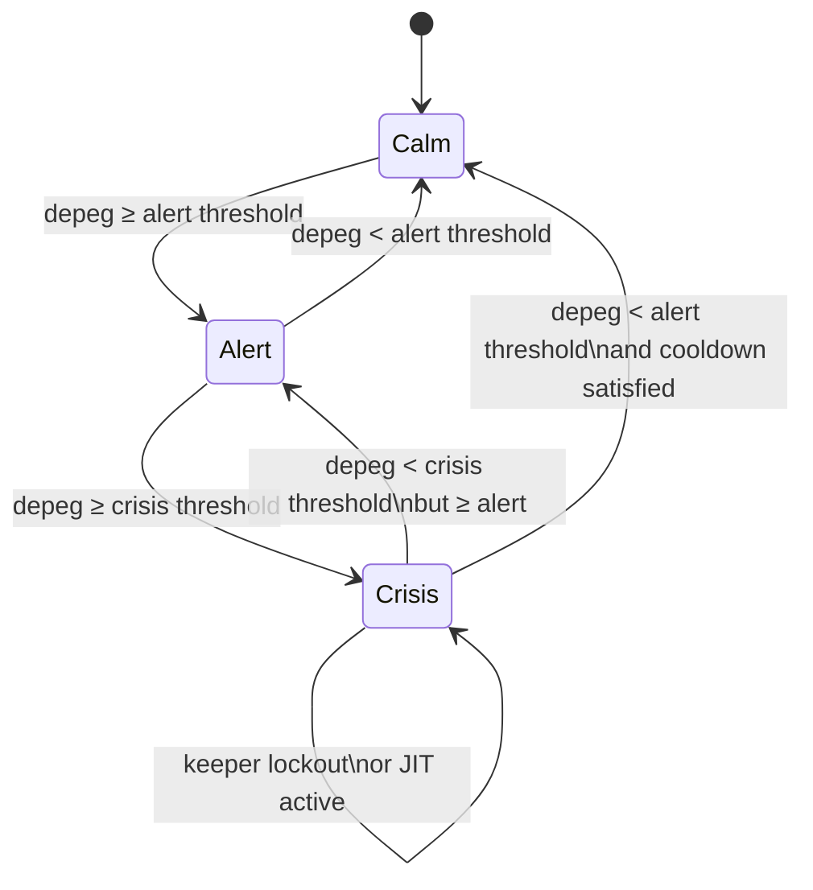
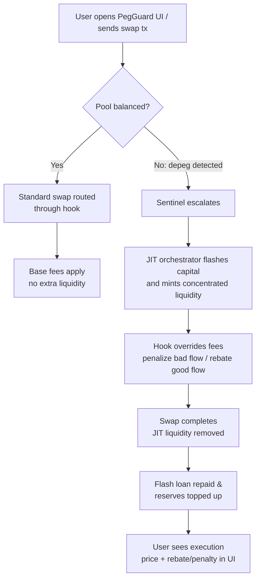

# PegGuard JIT

PegGuard JIT fuses oracle-aware risk controls with the Uniswap v4 just-in-time liquidity playbook. The result is a hook-driven stable-asset vault that:

- injects flash-loan powered liquidity bursts when a peg is at risk,
- discourages trades that widen the imbalance via oracle-driven fees, and
- rewards traders who help stabilize the pool by temporarily lowering their execution costs.

These capabilities allow the system to stay lean during calm periods while going on the offensive the moment a depeg event unfolds.

> **Competition target:** Built for the Uniswap Foundation prize pool under the *stable-asset Hooks* track, showcasing how v4 hooks can defend 1:1 pairs with adaptive fees and JIT liquidity.

## System Architecture

1. **Sentinel & Oracle Adapter** — Continuously reads Pyth price feeds for both sides of the stable pair, computes depeg severity, and tags pools as *balanced*, *at risk*, or *in crisis*.
2. **Dynamic Fee Hook** — A custom Uniswap v4 hook that overrides pool fees. It increases fees up to 5% for trades that worsen depegs and rebates users (down to 5 bps) who restore balance.
3. **JIT Liquidity Orchestrator** — Uses Aave/flash-loan providers to borrow depth only when the sentinel escalates a pool. Liquidity is added just-in-time, sits inside a tight tick band, and is pulled immediately after the trade window closes so debt can be repaid.
4. **Keeper & Automation Layer** — Off-chain executors monitor sentinel alerts, submit hook configuration updates, and trigger JIT liquidity scripts.
5. **Reserve & Treasury Manager** — Receives penalty fees, funds rebates, and enforces configurable reserve ratios per pool.
6. **On-chain Keeper Coordinator** — The new `PegGuardKeeper` contract mirrors the sentinel logic from our reference repo and atomically flips pool modes/JIT windows based on live Pyth feeds, enforcing cool-down windows and deterministic thresholds.

## Visual Architecture



## Swap Lifecycle

1. Sentinel detects volatility (>0.5% price gap from Pyth) and flags the pool.
2. Keeper triggers the JIT orchestrator which:
   - flashes capital,
   - mints concentrated liquidity around the target tick range,
   - seeds reserve balances for rebates.
3. During the volatile window the hook:
   - levies an extra fee when a swap worsens the peg,
   - routes a rebate plus reserve contribution when the swap restores the peg.
4. After the window closes liquidity is withdrawn, flash loans are repaid, and penalty fees are streamed to the reserve.

## Pool Mode State Machine



## User Flow



From the user’s perspective, PegGuard feels like a normal Uniswap swap except during volatile windows, where the interface surfaces whether their trade helped or hurt the peg along with any rebates or surcharges applied.

## Repository Layout

```
src/        Hook contracts (currently the template Counter hook placeholder)
script/     Foundry deployment scripts (to be updated for PegGuard flows)
test/       Forge-based hook tests
```

## Getting Started

```bash
forge install       # pulls dependencies declared in foundry.toml
forge test          # runs the hook test suite
# focused integration scenario
forge test --match-path test/PegGuardIntegration.t.sol
```

## Deployment

### Single Pool Deployment

Deploy and configure a single PegGuard pool:

```bash
# 1. Deploy the hook
forge script script/00_DeployHook.s.sol --rpc-url $RPC_URL --private-key $PRIVATE_KEY --broadcast

# 2. Deploy keeper and JIT manager
forge script script/05_DeployKeeperAndJIT.s.sol --rpc-url $RPC_URL --private-key $PRIVATE_KEY --broadcast

# 3. Deploy flash borrower (optional, for flash-loan bursts)
forge script script/04_DeployFlashBorrower.s.sol --rpc-url $RPC_URL --private-key $PRIVATE_KEY --broadcast

# 4. Configure the pool
forge script script/03_ConfigurePegGuard.s.sol --rpc-url $RPC_URL --private-key $PRIVATE_KEY --broadcast
```

### Multi-Pool Deployment

Deploy multiple pools from a JSON configuration file:

```bash
forge script script/06_MultiPoolDeploy.s.sol \
  --rpc-url $RPC_URL \
  --private-key $PRIVATE_KEY \
  --broadcast \
  --sig "run()" \
  --env POOL_CONFIG_JSON=config/example-pools.json
```

See `config/example-pools.json` for the expected JSON format.

### Demoable User Flow Script

`script/07_UserFlow.s.sol` mints two mock assets, wires them into the already deployed Sepolia contracts, and walks through the full PegGuard lifecycle:

1. Deploy mock PEG tokens and approve Permit2, the Position Manager, and the Hookmate router.
2. Initialize a brand-new v4 pool that uses the production `PegGuardHook`, configure fees/thresholds, and add concentrated liquidity.
3. Optionally fund the reserve token, perform a swap routed through the hook (with oracle-driven fees), and trigger `PegGuardKeeper.evaluateAndUpdate`.
4. Seed the `PegGuardJITManager` and run a `flashBurst` to demonstrate rapid JIT liquidity.

This script is ideal for recording a terminal demo — every critical step emits `console2` logs and leaves an on-chain tx for judges to inspect.

```bash
# Configure optional size knobs in env(.example lists USERFLOW_* keys)
cp env.example .env        # populate RPC_URL, PRIVATE_KEY, etc.

# Dry-run locally (Anvil or fork)
forge script script/07_UserFlow.s.sol

# Broadcast on Sepolia for TxIDs + Etherscan links
forge script script/07_UserFlow.s.sol \
  --rpc-url $RPC_URL \
  --private-key $PRIVATE_KEY \
  --broadcast -vvv
```

Set `USERFLOW_*` env vars to control LP size, swap notional, reserve funding, and JIT flash parameters. Leave them at zero to skip optional steps (reserve/JIT funding).

#### Demo Evidence (Sepolia)

The latest broadcast of `script/07_UserFlow.s.sol` (captured in `broadcast/07_UserFlow.s.sol/11155111/run-latest.json`) produced the following verifiable transactions on Sepolia:

| Flow Step | Tx Hash | Notes |
| --- | --- | --- |
| Deploy PegUSD mock token | `0x9e7bcc2772e70cf84ad031884616556ed5920595383605a8cd2a7f911c1215ee` | `MockERC20` constructor |
| Deploy PegETH mock token | `0xd70c32bb3bcc90de9fdbb30c1ce8fdf14806e55598e1ff614859cfd7b9360ce1` | `MockERC20` constructor |
| Initialize PegGuard pool (PositionManager) | `0x44dd52f66f71cf5b1b8b91bbacf33d911a32bd5af8225a73e7a7f99abdab8021` | `initializePool` call with PegGuard hook |
| Configure hook (oracle + fee bands) | `0x1d43df30bdea21c8950d571de481a76fb87844e940adbdc4efc6d2485e448d13` | `PegGuardHook.configurePool` |
| Add concentrated liquidity | `0x00e8a77daa4b99609e7200d16586180cdd4d30da48f3f78bc9f62094bd1c1b41` | `modifyLiquidities` with mint actions |
| Swap through PegGuard hook | `0x7a1b27e005179bf178f44c962c90bfc8f5cb3520042a68c13bada33628506eac` | Hookmate router calling the pool |
| Keeper evaluation | `0x4864c460dd87e82db50cee85f2fab35d788c29ec326d132ef30a284a7e864990` | `PegGuardKeeper.evaluateAndUpdate` |

Use any block explorer (e.g., `https://sepolia.etherscan.io/tx/<hash>`) to inspect the logs and confirm hook/keeper events.

### Environment Variables

Required environment variables for deployment:

**Core Contracts:**
- `PEG_GUARD_HOOK` - Deployed hook address
- `PEG_GUARD_KEEPER` - Deployed keeper address
- `PEG_GUARD_JIT_MANAGER` - Deployed JIT manager address
- `PEG_GUARD_ADMIN` - Admin address for role grants
- `POSITION_MANAGER` - Uniswap v4 PositionManager address
- `PERMIT2` - Permit2 contract address
- `POOL_MANAGER` - Uniswap v4 PoolManager address

**Pool Configuration:**
- `POOL_CURRENCY0` - Token address or symbol (WETH, USDC, USDT, DAI)
- `POOL_CURRENCY1` - Token address or symbol
- `POOL_TICK_SPACING` - Tick spacing (e.g., 60)
- `POOL_KEY_FEE` - Fee flag (use `0x800000` for dynamic fees)
- `PRICE_FEED_ID0` - Pyth price feed ID for currency0
- `PRICE_FEED_ID1` - Pyth price feed ID for currency1
- `POOL_BASE_FEE` - Base fee in bps (e.g., 3000 = 0.3%)
- `POOL_MAX_FEE` - Maximum fee in bps (e.g., 50000 = 5%)
- `POOL_MIN_FEE` - Minimum fee in bps (e.g., 500 = 0.05%)

**Keeper Configuration:**
- `KEEPER_ALERT_BPS` - Alert threshold in bps
- `KEEPER_CRISIS_BPS` - Crisis threshold in bps
- `KEEPER_JIT_BPS` - JIT activation threshold in bps
- `KEEPER_MODE_COOLDOWN` - Mode change cooldown in seconds
- `KEEPER_JIT_COOLDOWN` - JIT toggle cooldown in seconds

**JIT Configuration:**
- `JIT_TICK_LOWER` - Lower tick for JIT liquidity
- `JIT_TICK_UPPER` - Upper tick for JIT liquidity
- `JIT_MAX_DURATION` - Maximum burst duration in seconds
- `JIT_RESERVE_SHARE_BPS` - Reserve share in bps (e.g., 1000 = 10%)

**Optional:**
- `NETWORK_ID` - Network identifier (0 = mainnet, 1 = sepolia) for canonical addresses
- `TARGET_TICK_LOWER` - Target range lower tick
- `TARGET_TICK_UPPER` - Target range upper tick
- `POOL_ENFORCE_ALLOWLIST` - Enable allowlist enforcement (true/false)
- `TREASURY` - Treasury address for reserve shares (defaults to admin)

**Aave Integration:**
- `AAVE_POOL` - Aave V3 pool address (or use canonical address via NETWORK_ID)

### Canonical Addresses

The deployment scripts support canonical token addresses via the `AddressConstants` library. Set `NETWORK_ID=0` for mainnet or `NETWORK_ID=1` for Sepolia, then use token symbols (WETH, USDC, USDT, DAI) instead of addresses in `POOL_CURRENCY0` and `POOL_CURRENCY1`.

### Sepolia Reference Deployment

| Component | Address | Verification | Deploy Tx |
| --- | --- | --- | --- |
| PythOracleAdapter | `0x7F7408E16450c7c968fFef0a9E2e351232F54eA8` | Etherscan (standard) | `0xa8f00ff884a6a7645c428ef7260d0c3ef9ba86bd4334455ee63280308b2ded6c` |
| PegGuardHook | `0xBE98d00E9f9676F7195985d278b40F5A4610Da80` | Sourcify (Etherscan recognizes) | `0xc3899b9172cd6c0eabd0715268c0fcfad98081a51e8711633fcbe9779f97dedd` |
| PegGuardKeeper | `0x9C93926BcEf5Af829FA2e9B096fabb87508350ae` | Sourcify | `0x31b8fb4fff3414b2051f4ac0432e866467292ae8aa43662d56edec74c5e82dba` |
| PegGuardJITManager | `0x5E2DD3d96E81925e142d2F0dE2916aA952bb598f` | Sourcify | `0x9dc77e5c776dfda505e439e17efc1b1390bbe1e5f012be2ed94fe602b60fcafc` |
| PegGuardFlashBorrower | `0x8195D5Fdf8B825609f73188bb14b28413D0dc812` | Sourcify | `0x9ce0302fece908d29c02c212c84ec97b3315709ebdddeab201afc3ce2c121b64` |

- Hook configuration + policies (`script/03_ConfigurePegGuard.s.sol`):  
  `0x6468372692ad49f5ddd1a96a2a7278f4885d2146b880ea937baee3c39b034253`,  
  `0x527862c380730135ef7c942d4bf2a265e499ed3fd102b8034a3eaf55be426a8f`,  
  `0x3d5ea4813754aca15de281fd7a97c9717eb3aa5ec1a81b72966e22d946f8b0aa`,  
  `0xc3feeb05b5c708303856f7addc99c1e58ec278971656ffd06fc70a91c7e79335`,  
  `0xec7769b9f0e88672a3337c5a46fb1ae4f7eb4c94fad6e617ac5342aad7a19888`,  
  `0x75da5e870a56473d47a09d741a9eb198e87fc27a7f12ff0842561acf2663b19b`,  
  `0x3e64e077551e383743a9a0d65b391f3cc8161f19b3bd92f6dcd64c096b808189`,  
  `0x58d8fc20c0d30bd65bcfc5a8e381c6a80380b1006c30e3cb779b5f1fbcd1fca7`.
- Keeper evaluation test (proves hook flow): `0x977ab1dc419f116bb6cfd23a87e1d4d53d9901166bef357d17dbc5e081b96e9c`

> **Note on verification:** The Etherscan V1 endpoint cannot resolve nested imports like `src/base/BaseHook.sol`, so we verified contracts via Sourcify (supported by Etherscan) instead. PythOracleAdapter, which has no nested proxy imports, is verified via the standard API. If V2 verification becomes available, re-run `forge verify-contract` with `--verifier etherscan` and the same constructor args.


## Production Development Plan

| Phase | Goal | Key Tasks |
| --- | --- | --- |
| 0. Template Hardening | Align with upstream Uniswap v4 template | Replace `Counter.sol` with the PegGuard hook skeleton, wire forge remappings, and port BaseOverrideFee + Pyth adapter components |
| 1. Oracle & Fee Logic | Enforce dynamic depeg penalties | Implement the Pyth oracle adapter and dynamic fee logic, add sentinel configuration storage, write fork tests covering fee escalations and rebates |
| 2. JIT Liquidity Engine | Burst-liquidity deployment | Build a Foundry script that borrows via flash loans (Aave or Morpho), mints liquidity within configured ticks, and tears it down post-swap |
| 3. Keeper & Monitoring | Automated response | Ship a lightweight Node.js/Foundry keeper that watches pool price + oracle feed, triggers fee mode changes, and executes the JIT script |
| 4. Risk & Treasury | Long-term sustainability | Finalize reserve token strategy, stream penalty fees into reserves, expose admin/pauser/config roles |
| 5. Production Readiness | Harden + ship | End-to-end simulations, mainnet test deployment, audits, integrate dashboards/alerting |

Short-term priorities:

1. Port oracle-aware fee math into place, replacing `Counter.sol`.
2. Scaffold flash-loan-based liquidity scripts with mocked pools on anvil.
3. Write invariant/fork tests ensuring fees never drop below the base rate and flash-loan repayment always succeeds.
4. Document keeper configuration + environment variables once automation scripts exist.

## On-chain Components

- `PegGuardHook.sol` — Dynamic-fee hook that enforces oracle-aware penalties/rebates and tracks reserve state.
- `PythOracleAdapter.sol` — Lean adapter around Pyth price feeds, including staleness checks inspired by the CONTEXT repo.
- `PegGuardKeeper.sol` — Access-controlled sentinel/keeper contract that consumes Pyth prices, evaluates depeg severity, and directly calls into `PegGuardHook` to flip pool modes and JIT windows with configurable cooldowns.
- `PegGuardJITManager.sol` — Burst-liquidity orchestrator that borrows/pulls capital from funders, mints concentrated liquidity, and streams a slice of profits back into PegGuard reserves before unwinding positions.
- `flash/PegGuardFlashBorrower.sol` — Aave v3 flash borrower that triggers single-block bursts via `PegGuardJITManager.flashBurst`, enabling keeper-driven leverage without pre-funded inventory.

## Automation Stack

- `script/03_ConfigurePegGuard.s.sol` wires an existing pool into PegGuard contracts in one broadcast: configure price feeds + fee bands on the hook, keeper thresholds, and JIT tick ranges/reserve splits.
- `bots/keeper.ts` is a production-ready monitor that pulls fresh Pyth updates from the price service, pushes them on-chain, and triggers `PegGuardKeeper.evaluateAndUpdate` at a configurable cadence.
- `bots/jit.ts` watches `PegGuardHook` mode transitions and `PegGuardJITManager` state to automatically call `executeBurst` or `settleBurst` when crisis windows open/close.

Install the automation dependencies once:

```bash
pnpm install # or npm install
```

Run the bots by exporting the required env vars (RPC URL, private key, pool addresses, price feed IDs, etc.) and executing `pnpm keeper` / `pnpm jit`. Both scripts call real contracts (no mocks) and mirror the orchestration strategy from the CONTEXT repos.

**Env hints**

- `POOL_KEY_FEE` must equal the actual `PoolKey.fee` stored on-chain. For dynamic-fee pools set it to `0x800000` (`LPFeeLibrary.DYNAMIC_FEE_FLAG`) so the hook/keeper/JIT manager all hash to the same `PoolId`.
- See `docs/ARCHITECTURE.md` for an in-depth breakdown of how the Depeg Sentinel + JIT vault patterns are merged, reserve flows, automation layout, and the remaining roadmap.
- Multi-pool automation: set `PEG_GUARD_CONFIG=/path/to/config.json` and follow `docs/ops/runtime-config.md` for keeper/JIT bot configuration (sample at `docs/ops/example-config.json`).
- Script reference + deployment workflow lives in `docs/ops/scripts.md`, including the new `script/04_DeployFlashBorrower.s.sol` for Aave flash-burst deployments.


## Hackathon Delivery Roadmap

- **Day 0 – Alignment & Contracts**
  - Finalize pool assumptions (target stable pair, fee tiers, tick ranges).
  - Implement the PegGuard hook contract with oracle-driven fee overrides and reserve accounting.
  - Build oracle adapter and configuration access control so parameters can be tuned during judging.
- **Day 1 – Liquidity Engine & Tests**
  - Write Foundry scripts for JIT liquidity provisioning that borrow via flash loans (mocked locally, Aave-enabled on fork).
  - Cover hook + orchestrator interactions with fork tests, including peg-worsening/widening scenarios and repayment assertions.
- **Day 2 – Keeper & Monitoring**
  - Ship a simple automation bot (Typescript or Solidity script runner) that reads oracle deviation, toggles hook configs, and fires the JIT script.
  - Add logging/metrics hooks so demos can show historical peg defenses.
- **Day 3 – Demo Polish**
  - Package CLI commands plus a minimal web or terminal UI showing swap flow, rebates/penalties, and reserve status.
  - Record deterministic scenarios (via scripts) to replay during the hackathon pitch.

## Post-Hackathon Roadmap

1. **Multi-Pool Expansion** — Support multiple stable pairs simultaneously with pool-specific thresholds and reserve assets.
2. **Advanced Risk Controls** — Integrate volatility forecasts, circuit breakers, and asynchronous keeper voting to approve large liquidity moves.
3. **Treasury Strategy** — Automate reserve deployment into low-risk yields when idle, and expose governance controls for fee splits.
4. **Observability Suite** — Ship dashboards, on-chain event indexers, and alerting integrations for production readiness.
5. **Audit & Mainnet Rollout** — Formal verification, external audits, beta launch on L2s, followed by guarded mainnet deployment.
