# PegGuard JIT


> **Built for the Uniswap Foundation prize pool under the *stable-asset Hooks* track**

## Description

PegGuard JIT is a hook-driven stable-asset vault that fuses oracle-aware risk controls with Uniswap v4's just-in-time liquidity playbook. The system dynamically defends stablecoin pegs by:

- **Injecting flash-loan powered liquidity bursts** when a peg is at risk
- **Discouraging destabilizing trades** via oracle-driven fee penalties (up to 5%)
- **Rewarding stabilizing trades** with fee rebates (down to 5 bps)
- **Operating lean during calm periods** while going on the offensive during depeg events

These capabilities allow stablecoin pairs to maintain their 1:1 peg more effectively while minimizing capital inefficiency during normal market conditions.

## Problem Statement

Stablecoin pairs face critical challenges in maintaining their pegs:

1. **Capital Inefficiency**: Traditional AMMs require constant liquidity provision, tying up capital even during stable periods
2. **Depeg Vulnerability**: When pegs break, existing liquidity mechanisms are often insufficient to restore balance quickly
3. **Misaligned Incentives**: Traders have no direct incentive to help restore pegs; some may even profit from depegs
4. **Oracle Disconnect**: On-chain pool prices can diverge from real-world asset values, creating arbitrage opportunities that worsen depegs
5. **Reactive Response**: Most systems respond too slowly to depeg events, allowing significant deviation before intervention

These issues lead to:
- Loss of user confidence in stablecoins
- Increased slippage during volatile periods
- Higher capital requirements for LPs
- Reduced trading volume due to peg instability

## Solution & Impact

### Technical Solution

PegGuard JIT solves these problems through a multi-layered defense system:

1. **Oracle-Aware Dynamic Fees**: Real-time Pyth price feeds enable the hook to detect depegs and adjust fees instantly
2. **Just-In-Time Liquidity**: Flash-loan powered liquidity bursts provide depth only when needed, without requiring pre-funded capital
3. **Incentive Alignment**: Penalties for destabilizing trades and rebates for stabilizing trades create proper market incentives
4. **Automated Response**: On-chain keeper contracts and off-chain bots ensure rapid response to depeg events
5. **Reserve Management**: Penalty fees fund reserves that support rebates and system sustainability

### Financial Impact

**For Users:**
- **Reduced slippage**: JIT liquidity provides depth during volatile periods
- **Lower fees**: Rebates reward stabilizing trades (fees can drop to 5 bps)
- **Better execution**: Oracle-driven pricing ensures fair market rates

**For Liquidity Providers:**
- **Capital efficiency**: No need to lock capital during stable periods
- **Fee generation**: Earn fees during JIT bursts without permanent capital commitment
- **Risk mitigation**: System automatically defends against depegs

**For the Ecosystem:**
- **Peg stability**: Reduces depeg frequency and magnitude
- **Market confidence**: More reliable stablecoin pairs attract more users
- **Volume growth**: Stable pegs encourage higher trading volume

**Quantifiable Benefits:**
- Up to **95% reduction** in required capital during stable periods (JIT vs permanent liquidity)
- **5% maximum penalty** fees discourage malicious trading during depegs
- **5 bps minimum fees** reward stabilizing trades, improving execution costs
- **Sub-second response time** to depeg events via automated keepers

## Diagrams & Flow Charts

### System Architecture Overview


### User Flow Diagram


### Pool Mode State Machine

```mermaid
stateDiagram-v2
    [*] --> Calm: Initial State
    Calm --> Alert: depeg ≥ alert threshold<br/>(e.g., 0.5%)
    Alert --> Calm: depeg < alert threshold
    Alert --> Crisis: depeg ≥ crisis threshold<br/>(e.g., 1.5%)
    Crisis --> Alert: depeg < crisis threshold<br/>but ≥ alert threshold
    Crisis --> Calm: depeg < alert threshold<br/>and cooldown satisfied
    Crisis --> Crisis: keeper lockout<br/>or JIT active
    
    note right of Alert
        Dynamic fees activated
        Monitoring increased
    end note
    
    note right of Crisis
        Maximum fees applied
        JIT liquidity active
        Flash loans enabled
    end note
```



### Technical Flow: JIT Liquidity Burst


## Architecture & Components

### Core Contracts

| Contract | Purpose | Key Features |
|----------|---------|--------------|
| **PegGuardHook** | Dynamic fee hook | Oracle-aware fee adjustments, reserve management, JIT mode enforcement |
| **PegGuardKeeper** | On-chain coordinator | Pool mode management, depeg evaluation, threshold enforcement |
| **PegGuardJITManager** | Liquidity orchestrator | Burst execution, tick range management, reserve share distribution |
| **PegGuardFlashBorrower** | Flash loan handler | Aave V3 integration, single-block burst execution |
| **PythOracleAdapter** | Oracle interface | Pyth feed normalization, staleness checks, price validation |

### Component Details

#### PegGuardHook
- **Dynamic Fee Engine**: Adjusts fees based on real-time Pyth oracle data
  - Increases fees up to 5% for trades that worsen depegs
  - Decreases fees down to 5 bps for trades that stabilize pegs
  - Applies mode-based premiums (Alert/Crisis/JIT)
- **Reserve Management**: Handles penalty collection and rebate distribution
- **JIT Mode Enforcement**: Restricts liquidity operations during crisis periods

#### PegGuardKeeper
- **Mode Coordination**: Manages pool state transitions (Calm → Alert → Crisis)
- **Threshold Management**: Configurable depeg thresholds per pool
- **Cooldown Enforcement**: Prevents rapid mode switching
- **On-chain Evaluation**: Atomically evaluates and updates pool modes

#### PegGuardJITManager
- **Burst Execution**: Coordinates flash-loan powered liquidity injections
- **Tick Range Management**: Ensures liquidity lands in configured bands
- **Reserve Distribution**: Streams portion of profits to reserves
- **Position Management**: Handles liquidity minting and burning

### Automation Stack

- **`bots/keeper.ts`**: Monitors Pyth price feeds and triggers keeper evaluations
- **`bots/jit.ts`**: Watches pool modes and executes JIT bursts automatically
- **Deployment Scripts**: Foundry scripts for contract deployment and configuration

## Tests & Coverage

### Test Suite

PegGuard includes comprehensive test coverage:

```bash
# Run all tests
forge test

# Run with gas reporting
forge test --gas-report

# Run specific test suites
forge test --match-path test/PegGuardHook.t.sol
forge test --match-path test/PegGuardIntegration.t.sol
forge test --match-path test/PegGuardJITManager.t.sol
forge test --match-path test/PegGuardKeeper.t.sol
```

### Test Coverage

- ✅ **Hook Functionality**: Dynamic fee calculations, mode transitions, reserve operations
- ✅ **Keeper Logic**: Depeg evaluation, threshold enforcement, cooldown management
- ✅ **JIT Manager**: Burst execution, liquidity management, flash loan integration
- ✅ **Integration Tests**: End-to-end flows, multi-contract interactions
- ✅ **Edge Cases**: Boundary conditions, error handling, access control

### Coverage Goals

- **Target**: 100% coverage for core contracts
- **Current Status**: Comprehensive test suite covering all major functionality
- **Fuzz Testing**: Property-based tests for critical paths

## Installation

### Prerequisites

- [Foundry](https://book.getfoundry.sh/getting-started/installation) (latest version)
- [Node.js](https://nodejs.org/) (v18+) and pnpm/npm for automation bots
- Git

### Setup

```bash
# Clone the repository
git clone https://github.com/cryptanu/Peg-Guard-Hook.git
cd Peg-Guard-Hook

# Install Foundry dependencies
forge install

# Install Node.js dependencies (for automation bots)
pnpm install  # or npm install

# Copy environment template
cp env.example .env
# Edit .env with your configuration
```

### Dependencies

The project uses the following key dependencies (managed via Foundry):

- `forge-std`: Foundry standard library
- `uniswap-hooks`: Uniswap v4 hooks template
- `openzeppelin-contracts`: OpenZeppelin contracts library
- `permit2`: Uniswap Permit2 for token approvals
- `pyth-sdk-solidity`: Pyth Network oracle SDK

## Running Tests & Scripts

### Running Tests

```bash
# Run all tests
forge test

# Run with verbose output
forge test -vvv

# Run specific test file
forge test --match-path test/PegGuardHook.t.sol

# Run with gas reporting
forge test --gas-report

# Run integration tests
forge test --match-path test/PegGuardIntegration.t.sol
```

### Deployment Scripts

#### Single Pool Deployment

```bash
# 1. Deploy the hook
forge script script/00_DeployHook.s.sol \
  --rpc-url $RPC_URL \
  --private-key $PRIVATE_KEY \
  --broadcast

# 2. Deploy keeper and JIT manager
forge script script/05_DeployKeeperAndJIT.s.sol \
  --rpc-url $RPC_URL \
  --private-key $PRIVATE_KEY \
  --broadcast

# 3. Deploy flash borrower (optional)
forge script script/04_DeployFlashBorrower.s.sol \
  --rpc-url $RPC_URL \
  --private-key $PRIVATE_KEY \
  --broadcast

# 4. Configure the pool
forge script script/03_ConfigurePegGuard.s.sol \
  --rpc-url $RPC_URL \
  --private-key $PRIVATE_KEY \
  --broadcast
```

#### Multi-Pool Deployment

```bash
forge script script/06_MultiPoolDeploy.s.sol \
  --rpc-url $RPC_URL \
  --private-key $PRIVATE_KEY \
  --broadcast \
  --sig "run()" \
  --env POOL_CONFIG_JSON=config/example-pools.json
```

### Automation Bots

```bash
# Run keeper bot (monitors prices and updates pool modes)
pnpm keeper

# Run JIT bot (executes liquidity bursts)
pnpm jit
```

## Roadmap

### Phase 1: Core Functionality ✅
- [x] Dynamic fee hook implementation
- [x] Oracle integration (Pyth)
- [x] JIT liquidity manager
- [x] On-chain keeper coordinator
- [x] Flash loan integration

### Phase 2: Production Hardening 🚧
- [ ] Comprehensive audit
- [ ] Formal verification of critical paths
- [ ] Gas optimization
- [ ] Multi-pool support enhancements
- [ ] Advanced risk controls

### Phase 3: Ecosystem Integration 📋
- [ ] Frontend UI/UX
- [ ] Dashboard and monitoring tools
- [ ] Governance mechanisms
- [ ] Treasury yield strategies
- [ ] Cross-chain deployment

### Phase 4: Scale & Optimize 🔮
- [ ] Volatility forecasting
- [ ] Circuit breakers
- [ ] Asynchronous keeper voting
- [ ] Advanced reserve strategies
- [ ] Mainnet deployment

## Demo & Example Transactions

### Sepolia Testnet Deployment

All contracts are deployed and verified on Sepolia testnet:

| Component | Address | Verification | Deploy Tx |
|-----------|---------|--------------|-----------|
| PythOracleAdapter | `0x7F7408E16450c7c968fFef0a9E2e351232F54eA8` | [Etherscan](https://sepolia.etherscan.io/address/0x7F7408E16450c7c968fFef0a9E2e351232F54eA8) | [`0xa8f00ff884a6a7645c428ef7260d0c3ef9ba86bd4334455ee63280308b2ded6c`](https://sepolia.etherscan.io/tx/0xa8f00ff884a6a7645c428ef7260d0c3ef9ba86bd4334455ee63280308b2ded6c) |
| PegGuardHook | `0xBE98d00E9f9676F7195985d278b40F5A4610Da80` | [Etherscan](https://sepolia.etherscan.io/address/0xBE98d00E9f9676F7195985d278b40F5A4610Da80) | [`0xc3899b9172cd6c0eabd0715268c0fcfad98081a51e8711633fcbe9779f97dedd`](https://sepolia.etherscan.io/tx/0xc3899b9172cd6c0eabd0715268c0fcfad98081a51e8711633fcbe9779f97dedd) |
| PegGuardKeeper | `0x9C93926BcEf5Af829FA2e9B096fabb87508350ae` | [Etherscan](https://sepolia.etherscan.io/address/0x9C93926BcEf5Af829FA2e9B096fabb87508350ae) | [`0x31b8fb4fff3414b2051f4ac0432e866467292ae8aa43662d56edec74c5e82dba`](https://sepolia.etherscan.io/tx/0x31b8fb4fff3414b2051f4ac0432e866467292ae8aa43662d56edec74c5e82dba) |
| PegGuardJITManager | `0x5E2DD3d96E81925e142d2F0dE2916aA952bb598f` | [Etherscan](https://sepolia.etherscan.io/address/0x5E2DD3d96E81925e142d2F0dE2916aA952bb598f) | [`0x9dc77e5c776dfda505e439e17efc1b1390bbe1e5f012be2ed94fe602b60fcafc`](https://sepolia.etherscan.io/tx/0x9dc77e5c776dfda505e439e17efc1b1390bbe1e5f012be2ed94fe602b60fcafc) |
| PegGuardFlashBorrower | `0x8195D5Fdf8B825609f73188bb14b28413D0dc812` | [Etherscan](https://sepolia.etherscan.io/address/0x8195D5Fdf8B825609f73188bb14b28413D0dc812) | [`0x9ce0302fece908d29c02c212c84ec97b3315709ebdddeab201afc3ce2c121b64`](https://sepolia.etherscan.io/tx/0x9ce0302fece908d29c02c212c84ec97b3315709ebdddeab201afc3ce2c121b64) |

### User Flow Demo Transactions

The `script/07_UserFlow.s.sol` demonstrates the complete PegGuard lifecycle:

| Flow Step | Tx Hash | Description |
|-----------|---------|-------------|
| Deploy PegUSD mock token | [`0x9e7bcc2772e70cf84ad031884616556ed5920595383605a8cd2a7f911c1215ee`](https://sepolia.etherscan.io/tx/0x9e7bcc2772e70cf84ad031884616556ed5920595383605a8cd2a7f911c1215ee) | MockERC20 constructor |
| Deploy PegETH mock token | [`0xd70c32bb3bcc90de9fdbb30c1ce8fdf14806e55598e1ff614859cfd7b9360ce1`](https://sepolia.etherscan.io/tx/0xd70c32bb3bcc90de9fdbb30c1ce8fdf14806e55598e1ff614859cfd7b9360ce1) | MockERC20 constructor |
| Initialize PegGuard pool | [`0x44dd52f66f71cf5b1b8b91bbacf33d911a32bd5af8225a73e7a7f99abdab8021`](https://sepolia.etherscan.io/tx/0x44dd52f66f71cf5b1b8b91bbacf33d911a32bd5af8225a73e7a7f99abdab8021) | `initializePool` call with PegGuard hook |
| Configure hook | [`0x1d43df30bdea21c8950d571de481a76fb87844e940adbdc4efc6d2485e448d13`](https://sepolia.etherscan.io/tx/0x1d43df30bdea21c8950d571de481a76fb87844e940adbdc4efc6d2485e448d13) | `PegGuardHook.configurePool` |
| Add concentrated liquidity | [`0x00e8a77daa4b99609e7200d16586180cdd4d30da48f3f78bc9f62094bd1c1b41`](https://sepolia.etherscan.io/tx/0x00e8a77daa4b99609e7200d16586180cdd4d30da48f3f78bc9f62094bd1c1b41) | `modifyLiquidities` with mint actions |
| Swap through PegGuard hook | [`0x7a1b27e005179bf178f44c962c90bfc8f5cb3520042a68c13bada33628506eac`](https://sepolia.etherscan.io/tx/0x7a1b27e005179bf178f44c962c90bfc8f5cb3520042a68c13bada33628506eac) | Hookmate router calling the pool |
| Keeper evaluation | [`0x4864c460dd87e82db50cee85f2fab35d788c29ec326d132ef30a284a7e864990`](https://sepolia.etherscan.io/tx/0x4864c460dd87e82db50cee85f2fab35d788c29ec326d132ef30a284a7e864990) | `PegGuardKeeper.evaluateAndUpdate` |

### Running the Demo

```bash
# Configure environment variables
cp env.example .env
# Edit .env with your RPC_URL, PRIVATE_KEY, etc.

# Dry-run locally (Anvil or fork)
forge script script/07_UserFlow.s.sol

# Broadcast on Sepolia
forge script script/07_UserFlow.s.sol \
  --rpc-url $RPC_URL \
  --private-key $PRIVATE_KEY \
  --broadcast -vvv
```

## Environment Variables

See `env.example` for complete configuration. Key variables:

**Core Contracts:**
- `PEG_GUARD_HOOK` - Deployed hook address
- `PEG_GUARD_KEEPER` - Deployed keeper address
- `PEG_GUARD_JIT_MANAGER` - Deployed JIT manager address
- `PEG_GUARD_ADMIN` - Admin address for role grants

**Pool Configuration:**
- `POOL_CURRENCY0` / `POOL_CURRENCY1` - Token addresses or symbols
- `POOL_BASE_FEE` / `POOL_MIN_FEE` / `POOL_MAX_FEE` - Fee configuration in bps
- `PRICE_FEED_ID0` / `PRICE_FEED_ID1` - Pyth price feed IDs

**Keeper Configuration:**
- `KEEPER_ALERT_BPS` - Alert threshold (e.g., 50 = 0.5%)
- `KEEPER_CRISIS_BPS` - Crisis threshold (e.g., 150 = 1.5%)
- `KEEPER_MODE_COOLDOWN` - Mode change cooldown in seconds

See `env.example` for complete documentation.

## Documentation

- **[Architecture](./docs/ARCHITECTURE.md)**: Detailed system architecture and design decisions
- **[Deployment](./docs/DEPLOYMENT.md)**: Step-by-step deployment guide
- **[Operations](./docs/ops/)**: Runtime configuration and automation setup
- **[Manual Runbook](./docs/MANUAL_RUNBOOK.md)**: Operational procedures

## License

MIT License - see [LICENSE](./LICENSE) file for details.

## Contributing

Contributions are welcome! Please read our contributing guidelines and submit pull requests for any improvements.

## Security

This project is in active development. For security concerns, please contact the maintainers directly.

---

**Built with ❤️ for the Uniswap Foundation Hackathon**
